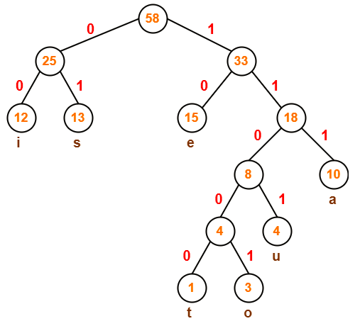
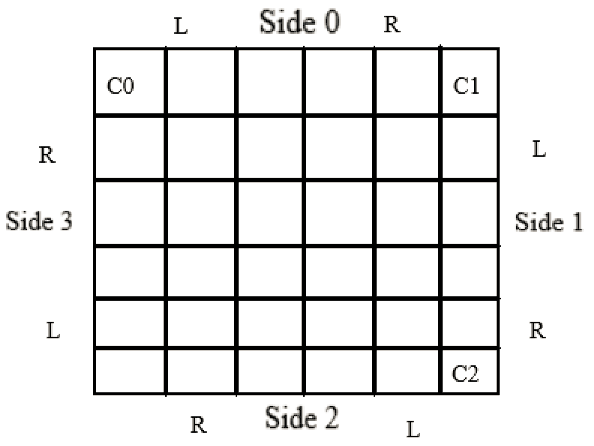

# Image Stegonagraphy Using an Edge Based Embedding Technique
## Prerequisites
- Python 3.7 or above
- Python virtual environment

## Libraries to be installed
- opencv-python

## Methodology
<b>Text Compression</b> 
Huffman coding has been used for this purpose. Frequency of occurrence of all characters in input is calculated and placed in bottom of a tree.
 Then, the two nodes with lowest frequencies are taken and added to make a node. This process is repeated until only one node is left (root node).
 From each node, the node to the left is marked 0 and right is marked 1. Then each character’s code is path from root node to the character.

In the above figure, ‘i’ will be represented by 00, ‘o’ will be represented as 11001 and so on.

<b>Text Embedding Algorithm</b> 
For an image, some terminology is defined.
 The top side is side 0 and increments in clockwise direction. Each side also has a left and right indicator that is relative to facing outwards from that side.
 The sides are also represented in 2 bit binary as 00, 01, 10 and 11.
 Three corners starting from top left corner are marked as 0, 1 and 2 as seen in the figure below.

3 unique integers are randomized between 0 and 3 to get 3 sides. 3 integers between 0 and 1 are randomized to get the mode for these 3 sides.
 Mode = 0 denotes that embedding has to be carried out from left to right indicator for that side. Mode = 1 denotes that embedding has to be carried out from right to left indicator for that side.
 Three 3 bit binary numbers are generated from this information.
 For example: if one result is side = 0, mode = 1, then the binary number corresponding to it is 001
 For each of these binary numbers, the 3 bits are embedded in the LSBs of the 3 channels in the corner pixels at C0, C1 and C2 respectively. This is useful later while retrieving.
 The sides generated denote the order in which data has to be embedded into them.
 For example: if 3, 0, 2 are 3 sides generated; then embedding order would be [3, 0, 2, 1]. The final side would just be the remaining one and its mode would be defaulted to 0.
 Now, we have the order of sides in which data has to be embedded and operation modes of all of them, so we can start embedding the input. No data has to be embedded in the corner pieces.
 The length of the input is found, converted to a 16 bit binary and then appended in the beginning that determines the terminating codition while retrieving.

<b>Text Retrieving Algorithm</b> 
While embedding, we had stored the side order and modes in 3 corners. First, that information in retrieved and 4th side is the side not contained in it and has mode 0.
 The bits are extracted similar to the embedding process, going through the sides according to the order and moving to next pixels in side according to the operation mode. If we reach the end of any side, then we have to go one edge inwards and get the side order and modes corresponding to that edge again.
 While embedding, we had padded the length of the message in front of the input by converting it into 16 bit binary. So after first 16 bits are retrieved, convert it to decimal. That will provide how many more bits are left to be retrieved.
 Once these bits are retrieved, we have successfully recovered the embedded bits. From the recovered data, discard first 16 bits as they are no longer useful.

<b>Text Decompression</b> 
Current node is set to root node. The data is traversed, if 0 occurs we go left in the tree otherwise we go right in the tree. If a leaf node occurs we have obtained a character, then we go back to root node and continue.

For example: In the above figure, if data is 1111101, start traversing from root node. We go right, right, right. It is a leaf so ‘a’ is printed and go back to root.  Now go right, right, left, right. It is a leaf so ‘u’ is printed.

## Hiding Capacity
For an image with r rows and c columns:
 top = ceil(r/2) - 1
 Number of bits that can be embedded = 6xtopx(r + c) – 12x(top)x(top + 1)
 Ideally a 1920x1080 image or higher should be used that would allow 758 Kilo Bytes of compressed text to be embedded
